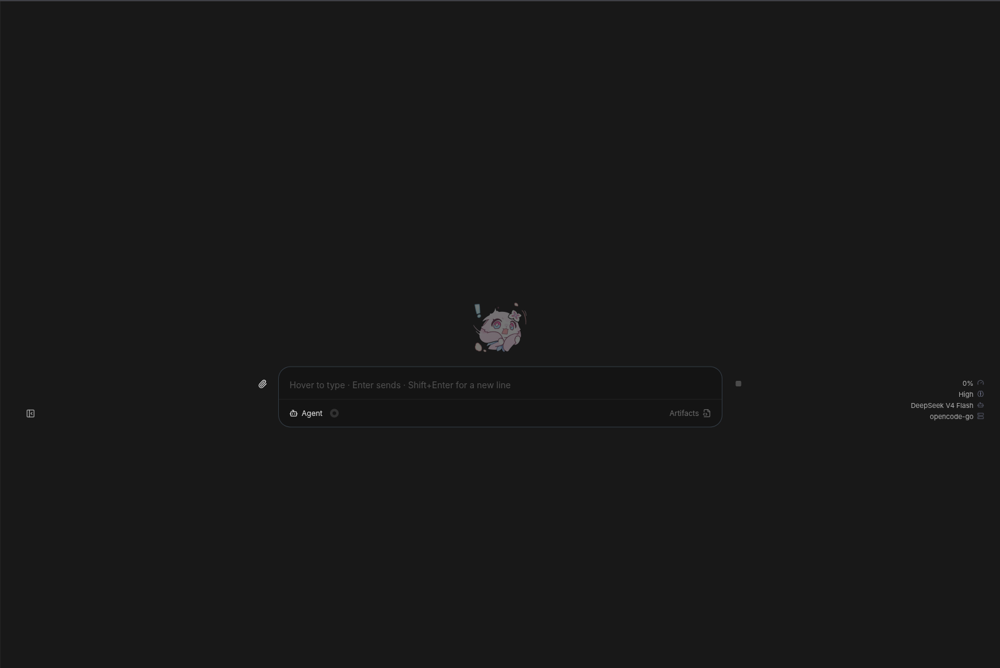

  <h1>Fragment</h1>waaa
  
  waaa
    
  
AI Orchestrator based on Pi

  
    
  
<b>Personal Agent.</b>

  
<b>~~ * ~~</b>

  
This version is more lightweight since its strip several features and focus for web only

    

Fork of <a href="https://github.com/IgorWarzocha/howcode">howcode<a/>

